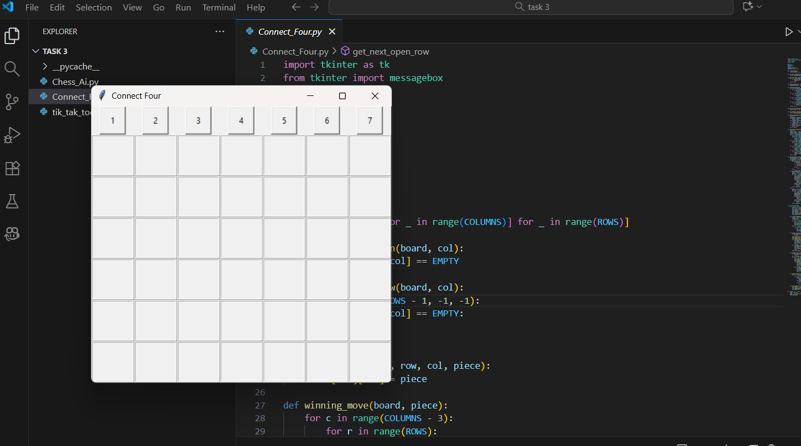
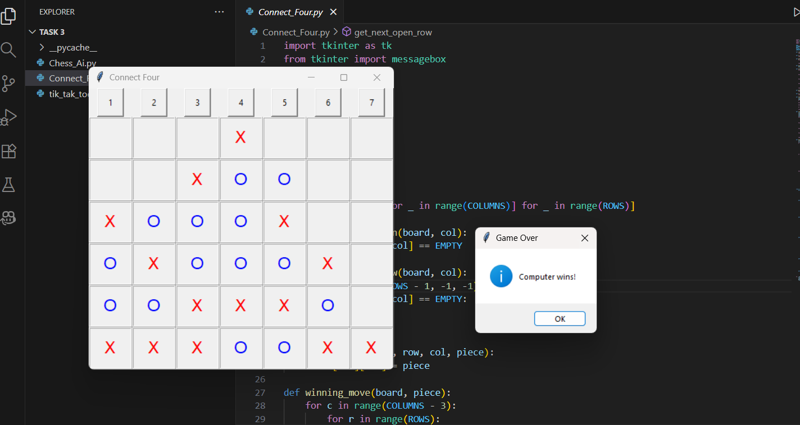

# Connect Four Game (Python Tkinter)

A GUI-based **Connect Four** game implemented in **Python** using **Tkinter**, where you can play against an AI computer opponent. The computer uses the **Minimax algorithm with Alpha-Beta pruning** to make optimal moves.

---

## 🎮 Game Description

Connect Four is a two-player connection game where players take turns dropping colored pieces into a vertical 7-column, 6-row grid. The goal is to be the first to form a horizontal, vertical, or diagonal line of four of your own pieces.

- **Player Piece:** `X` (Red)  
- **Computer Piece:** `O` (Blue)  
- **Grid Size:** 6 rows × 7 columns

---

## 🖥️ How to Run

1. Make sure you have **Python 3.8+** installed. You can download it from [python.org](https://www.python.org/downloads/).

2. Clone or download this repository:

```bash
git clone https://github.com/yourusername/connect-four-tkinter.git
cd connect-four-tkinter
````

3. Run the game:

```bash
python connect_four.py
```

> The game window will open. Click on the column buttons to drop your piece. The AI will play automatically after your move.

---

## ⚙️ Requirements

* **Python 3.8+**
* **Tkinter** (comes pre-installed with Python on most systems)
  No additional libraries are needed.

---

## 🕹️ How to Play

1. Click a column button (1-7) to drop your `X` piece.
2. The computer will automatically make its move with an `O` piece.
3. The game continues until one player connects **four pieces** in a row horizontally, vertically, or diagonally, or until the grid is full (draw).
4. A message box will appear announcing the winner or a draw.
5. The game will reset automatically after a win or draw.

---

## 🧠 AI Algorithm Used

The computer uses the **Minimax algorithm with Alpha-Beta pruning** to decide its moves:

* **Minimax Algorithm:** Evaluates all possible moves and chooses the optimal one by assuming the opponent plays optimally.
* **Alpha-Beta Pruning:** Optimizes Minimax by skipping branches that won't affect the final decision.

This makes the AI smart enough to block winning moves and create opportunities to win.

---

## 🎨 Design

* **Tkinter GUI:**

  * Buttons for columns (1-7)
  * Grid display using Labels for pieces
  * Red `X` for the player and Blue `O` for the computer
* **Board Representation:** 2D list of size 6x7
* **Game Logic:** Checks for valid moves, winning conditions, and draw situations
* **Reset Functionality:** Automatic after each game

---

## 📸 Screenshots




*Click a column to drop your piece. The AI plays instantly after your turn.*

---

## 📝 Notes

* The AI depth is set to **4**, which provides a challenging but fast response.
* The game automatically resets after completion.
* You can modify `ROWS`, `COLUMNS`, and `depth` in the code to adjust difficulty or board size.

---

## 🧩 Future Improvements

* Add difficulty levels (Easy, Medium, Hard).
* Enable two-player mode.
* Add animations for dropping pieces.
* Track player statistics.

---
